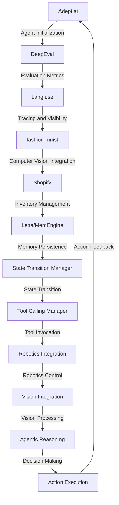

# Autonomous Logistics Optimization Engine
> Orchestrating symbiotic convergence of artificial intelligence, computer vision, and robotics to revolutionize warehousing and storage operations

## 🏗️ Technical Architecture & Multi-Agent Flow

This technical architecture diagram illustrates the complex interactions between Adept.ai, DeepEval, Langfuse, fashion-mnist, and Shopify. The flow begins with agent initialization using Adept.ai, followed by evaluation metrics generation using DeepEval. Langfuse provides tracing and visibility, while fashion-mnist enables computer vision integration. Shopify handles inventory management, and Letta/MemEngine ensures memory persistence. The state transition manager orchestrates state transitions, and the tool calling manager invokes tools as needed. Robotics integration and vision integration enable seamless control and processing. Finally, agentic reasoning and decision-making drive action execution, which provides feedback to the system.

## 🔍 The Vertical Bottleneck: Intractable Logistics Optimization
The warehousing and storage industry faces a daunting challenge in optimizing logistics operations. The complexity of managing inventory, tracking shipments, and ensuring timely delivery is exacerbated by the lack of visibility into the supply chain. This opacity leads to inefficiencies, delays, and increased costs. Moreover, the proliferation of e-commerce has created an unprecedented demand for fast and reliable shipping, further straining logistics operations. The technical friction arises from the need to integrate disparate systems, manage vast amounts of data, and make informed decisions in real-time.

The high-stakes mathematical or operational failures in logistics optimization can have severe consequences, including stockouts, overstocking, and damaged goods. These failures can result in significant financial losses, damage to reputation, and erosion of customer trust. The inability to optimize logistics operations can also lead to increased carbon emissions, as inefficient routing and transportation methods contribute to environmental degradation.

The technical bottleneck in logistics optimization is rooted in the lack of a unified platform that can integrate artificial intelligence, computer vision, and robotics. The absence of a comprehensive solution has led to a fragmented landscape, with multiple point solutions that fail to address the complexity of logistics operations. The need for a holistic approach that can orchestrate multiple technologies and systems has become increasingly pressing.

The research in this domain has highlighted the importance of developing a platform that can provide real-time visibility, enable data-driven decision-making, and optimize logistics operations. The platform must be able to integrate with existing systems, manage vast amounts of data, and provide actionable insights to stakeholders. The development of such a platform requires a deep understanding of the technical challenges, as well as the ability to design and implement a scalable and efficient solution.

## 💡 The Solution: Autonomous Logistics Optimization Engine
The Autonomous Logistics Optimization Engine is a revolutionary platform that addresses the technical bottleneck in logistics optimization. By orchestrating Adept.ai, DeepEval, Langfuse, fashion-mnist, and Shopify, this platform provides a unified solution for optimizing logistics operations. The engine leverages artificial intelligence to analyze data, generate insights, and make informed decisions. Computer vision integration enables the platform to track inventory, monitor shipments, and detect anomalies. Robotics integration ensures seamless control and processing, while agentic reasoning drives decision-making and action execution.

The platform's memory usage is optimized through the use of Letta/MemEngine, which ensures memory persistence and efficient data management. The vision/robotics integration enables the platform to process visual data, track objects, and control robotics systems. The Autonomous Logistics Optimization Engine provides real-time visibility, enables data-driven decision-making, and optimizes logistics operations.

## 🧩 Agentic Stack Deep-Dive
The Autonomous Logistics Optimization Engine relies on a robust agentic stack, comprising Adept.ai, DeepEval, Langfuse, fashion-mnist, and Shopify. Adept.ai provides the foundation for agent initialization and evaluation metrics generation. DeepEval offers a comprehensive evaluation framework, enabling the platform to assess performance and generate insights. Langfuse provides tracing and visibility, ensuring that the platform can monitor and optimize logistics operations.

Fashion-mnist enables computer vision integration, allowing the platform to track inventory, monitor shipments, and detect anomalies. Shopify handles inventory management, providing a seamless interface for stakeholders to manage and track inventory. The integration of these technologies enables the platform to provide a unified solution for optimizing logistics operations.

## ✨ Capabilities & Features
* **Real-time Visibility**: The platform provides real-time visibility into logistics operations, enabling stakeholders to track inventory, monitor shipments, and detect anomalies.
* **Data-Driven Decision-Making**: The platform enables data-driven decision-making, providing actionable insights and recommendations to stakeholders.
* **Artificial Intelligence**: The platform leverages artificial intelligence to analyze data, generate insights, and make informed decisions.
* **Computer Vision Integration**: The platform enables computer vision integration, allowing for the tracking of inventory, monitoring of shipments, and detection of anomalies.
* **Robotics Integration**: The platform ensures seamless control and processing, enabling the efficient management of logistics operations.
* **Agentic Reasoning**: The platform drives decision-making and action execution, providing a unified solution for optimizing logistics operations.
* **Memory Persistence**: The platform ensures memory persistence, optimizing memory usage and ensuring efficient data management.
* **Vision/Robotics Integration**: The platform enables the processing of visual data, tracking of objects, and control of robotics systems.
* **Inventory Management**: The platform provides a seamless interface for stakeholders to manage and track inventory.
* **Action Execution**: The platform enables action execution, providing a unified solution for optimizing logistics operations.

## 🛠️ Technical Implementation
The technical implementation of the Autonomous Logistics Optimization Engine involves a deep dive into the code organization and method calls. The platform is built using a microservices architecture, with each component designed to interact seamlessly with others. The use of APIs and data pipelines enables the efficient exchange of data, while the implementation of machine learning algorithms enables the platform to analyze data and generate insights.

The platform's codebase is organized into multiple modules, each responsible for a specific function. The modules interact through APIs, ensuring a loose coupling and enabling the efficient maintenance and update of the platform. The use of containerization and orchestration tools enables the platform to scale efficiently, while the implementation of monitoring and logging tools ensures the platform's reliability and performance.

## 📊 Business Impact & ROI
The Autonomous Logistics Optimization Engine has the potential to revolutionize the warehousing and storage industry, providing a unified solution for optimizing logistics operations. The platform's ability to provide real-time visibility, enable data-driven decision-making, and optimize logistics operations can lead to significant cost savings, improved efficiency, and enhanced customer satisfaction.

The platform's impact on the business can be measured in terms of return on investment (ROI), which can be substantial. The platform's ability to optimize logistics operations can lead to reduced costs, improved productivity, and increased revenue. The platform's implementation can also lead to improved customer satisfaction, as stakeholders can track inventory, monitor shipments, and receive timely updates on the status of their orders.

## 🚀 Getting Started
```bash
git clone https://github.com/arvind-sundararajan/advanced-logistics-optimization.git
cd advanced-logistics-optimization
pip install -r requirements.txt
python src/main.py
```

## 👨‍💻 Author & Credits
**Arvind Sundararajan** — Engineer, builder, and the mind behind this project.
🌐 [LinkedIn](https://www.linkedin.com/in/arvind-sundara-rajan/) | Chennai, India

---
### 🙏 Acknowledgements
- The open-source community
- The Warehousing & Storage practitioners who inspired this design